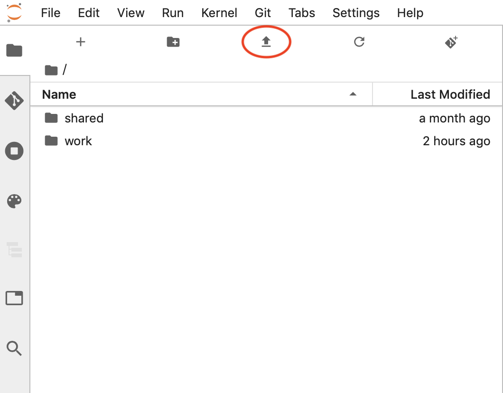
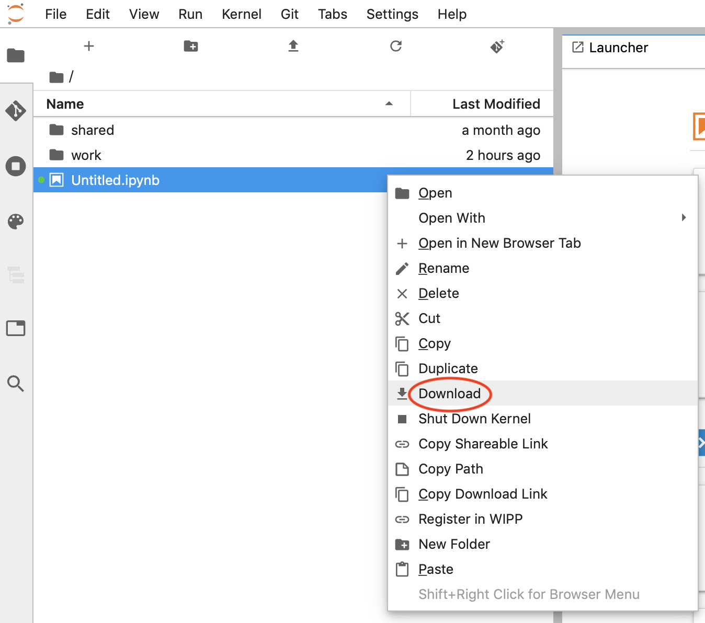

File Management
===============

Opening Files
-----------------
The file browser and File menu enable you to work with files and directories on your system. This includes opening, creating, deleting, renaming, downloading, copying, and sharing files and directories.

The file browser is in the left sidebar Files tab:

Arrow pointing to the file browser in the upper left sidebar.

Many actions on files can also be carried out in the File menu:

A screenshot showing the File menu open including options like "New", "Save All."

To open any file, double-click on its name in the file browser:

You can also drag a file into the main work area to create a new tab:

Many files types have :ref:`multiple viewers/editors <file-and-output-formats>`. For example, you can open a Markdown file in a :ref:`text editor <file-editor>` or as rendered HTML. A JupyterLab extension can also add new viewers/editors for files. To open a file in a non-default viewer/editor, right-click on its name in the file browser and use the "Open With..." submenu to select the viewer/editor:

A single file can be open simultaneously in multiple viewer/editors and they will remain in sync:

The file system can be navigated by double-clicking on folders in the listing or clicking on the folders at the top of the directory listing:

Right-click on a file or directory and select "Copy Shareable Link" to copy a URL that can be used to open JupyterLab with that file or directory open.

A screenshot showing the Copy Shareable Link option in the context menu opened over a file, which is the last entry on the list.

Right-click on a file or directory and select "Copy Path" to copy the filesystem relative path. This can be used for passing arguments to open files in functions called in various kernels.
Creating Files and Activities

Create new files or activities by clicking the + button at the top of the file browser. This will open a new Launcher tab in the main work area, which enables you to pick an activity and kernel:

You can also create new documents or activities using the File menu:

A screenshot showing the context menu entry for creating a new file.

The current working directory of a new activity or document will be the directory listed in the file browser (except for a terminal, which always starts in the root directory of the file browser):

A new file is created with a default name. Rename a file by right-clicking on its name in the file browser and selecting “Rename” from the context menu:

Important folders
-----------------

While working in Notebooks, it is important to keep in mind the folder
structure. When logging into Notebooks, users see two folders in the
file browser on the left: ``shared`` and ``work``.

-  ``shared`` folder is the symbolic link to ``/opt/shared``, which is
   reserved for shared storage across all apps. Currently, there are two
   folders inside of ``shared``: ``notebooks`` and ``wipp``.

   -  ``notebooks`` is the shared folder for all users of notebooks
      across the deployemnt. That allows to store some common notebooks,
      code and datasets and collaborate on them with other users of
      Notebooks
   -  ``wipp`` contains file storage for WIPP, including Image
      Collections, CSV collections, registered notebooks, Stitching
      vectors and Pyramids. Keep in mind that this folder is in the
      read-only mode; if you need to add new image collection, please
      use WIPP UI.

-  ``work`` is the users’ persistent storage. All files in that folder
   will persist the notebook restarts and is the place to keep your
   work.

All the files and folders created in the home folder outside of
``shared`` and ``work`` will be deleted on notebook restart, which
happen after a period of inactivity (15-60 minutes).

Uploading and Downloading
------------

Files can be uploaded to the current directory of the file browser by dragging and dropping files onto the file browser, or by clicking the "Upload Files" button at the top of the file browser:

Any file in JupyterLab can be downloaded by right-clicking its name in the file browser and selecting “Download” from the context menu:
To upload a file, click on the upload button in file panel on the left:

   anaconda_cloud_1

You can upload multiple files, but you cannot upload folders. Workaround
for uploading folders is to use Git integration or creating archive and
uploading it and later unarchiving.

File downloads
--------------

To download file, right-click on it in the Files panel on the left

   anaconda_cloud_1

You can not download multiple files at once. You can not download
folders. As a workaround, put your files/folders to archive and then
download archive.

Deleting folders
----------------

To protect users from accidentaly deleting the folder, JupyterLab made a
decision to block non-empty folder deletion with right-click
(https://github.com/jupyterlab/jupyterlab/issues/835). Unfortunately,
until the issue is fixed, you would have to delete everything from
inside the folder manually *or* use the Termianl to delete the folder.
In Terminal you can run the command: ``rm -rf <folder_path>`` to delete
the folder.

Displaying Hidden files
-----------------------

Displaying Hidden files

Hidden files and folders can be displayed in JupyterLab by combining two parameters:

    First the server should be allowed to serve hidden files by setting ContentsManager.allow_hidden = True; see server documentation.
    Then you will be able to display or hide the hidden files through the menu View -> Show Hidden Files.
